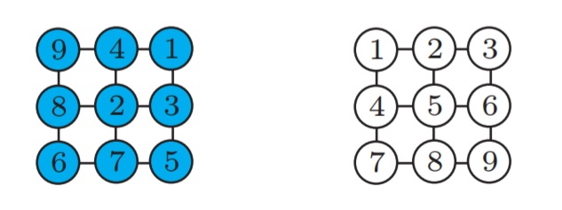

# Multi-Robot Path Planning on Graphs

We study the problem of optimal multi-robot path planning on graphs (MPP) over the makespan (last arrival time) criteria. We implemented A* search algorithm to find solution. In an MPP instance, the robots are uniquely labeled (i.e., distinguishable) and
are confined to an nxn squared connected graph. The robots may move from a vertex to an adjacent one in one time step in the
absence of collision, which may occur when two robots simultaneously move to the same vertex or along the same edge in
different directions. A distinguishing feature of our MPP formulation is that we allow robots on fully occupied cycles to rotate
synchronously.

Let *G = (V, E)* be a connected, undirected, simple graph, with *V = {vi}* being the vertex set and *E = {(vi, vj )}* the edge
set. Let *R = {r1, . . . , rn}* be a set of *n* robots. The robots move at discrete time steps (i.e., at *t = 0, 1, . . .*). At time step t = 0, each robot occupies a distinct vertex of *G*. In general, at any time step *t = 0, 1, . . .*, the robots assume a configuration that is an injective map from *R* to *V* . The start (initial) and goal configurations of the robots are denoted as *xI* and *xG*, respectively.
Following figure shows a possible configuration and its possible goal configuration of 9 robots on a 3 × 3 grid graph. 



During a discrete time step, each robot may either remain stationary or move to an adjacent vertex. To formally describe a plan, let a scheduled path be a map *pi : Z+ → V* , in which *Z+ := N ∪ {0}*. A scheduled path pi is feasible if it satisfies the following properties: 

* 1) pi(0) = xI (ri). 

* 2) For each i, there exists a smallest ti ∈ Z+ such that pi(ti) = xG(ri). 

* 3) For any t ≥ ti, pi(t) ≡ xG(ri). 

* 4) For any 0 ≤ t < ti , (pi(t), pi(t + 1)) ∈ E or pi(t) = pi(t + 1) (if pi(t) = pi(t + 1)

robot ri stays at vertex pi(t) between the time steps t and t + 1). We say that two paths pi, pj are in collision if there exists k ∈ Z+ such that pi(t) = pj (t) (meet collision) or (pi(t), pi(t + 1)) = (pj (t + 1), pj (t)) (head-on collision). 

## Solution

To solve above problem, we implemented A* algorithm to find optimum route from given initial 3x3 robot positions and desired 3x3 robot positions. First algorithm starts to construct graph, whose connections shows possible movement. Then we extented it as time based graph. According to time extented graph, all nodes are dublicated for every single of time step. That means, if we have 3x3 node for given example, we will have 3x3xts number of node in our time expanded graph. We set it ts=7 for our demo which means algorithm just search optimal solution up to 7 time step. Every node in t layer has connection to its own node in (t+1) layer but it has connection to one step far nodes in (t+1) layer as well.

## Result

You can define your own start and end positions of all 9 robot repectively. For instance here is the demo's starting and end positions.

``` 
sp=[3 5 6 2 9 7 8 4 1];
ep=[1 2 3 4 5 6 7 8 9] + ngrid*ngrid*(ts-1);
```
You should define all 9 robots start position with sp vector. !st elemnet show 1st robot position, 2nd element show 2nd robot position. So as given vector, 1st robot stay on 3th cell, 2nd robot stay on 5th cell, as how it was in above figure. 

You can run all demo with following command.
``` 
> main
```
Then you will take following results for given start and end positions.


## Reference
[1] Yu, Jingjin, and Steven M. LaValle. "Optimal multirobot path planning on graphs: Complete algorithms and effective heuristics." IEEE Transactions on Robotics 32.5 (2016): 1163-1177.
